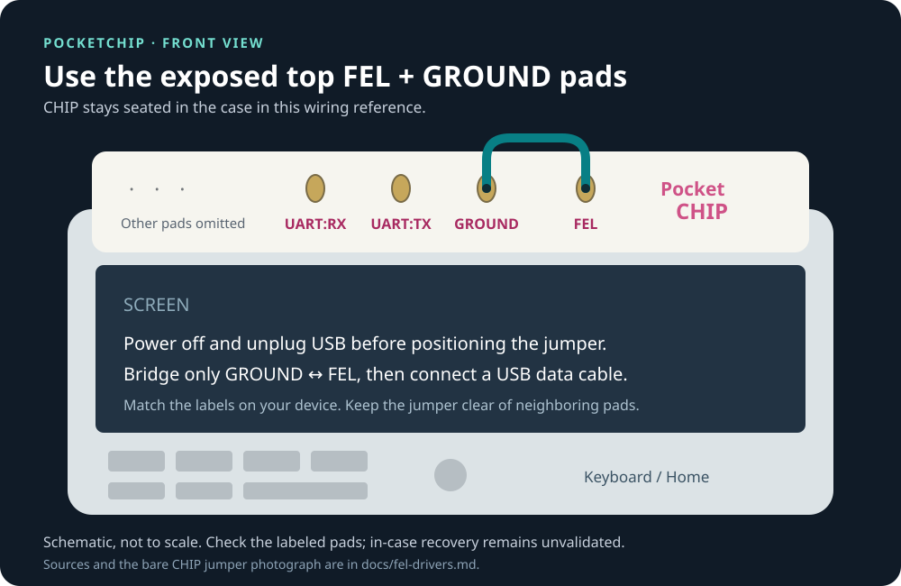

# Vitrallis Flasher

> **WARNING: Flashing erases all existing data on the PocketCHIP’s internal NAND.**
> Vitrallis Flasher will not preserve, back up, migrate or restore the existing
> operating system, documents, saves, applications or settings. **You are responsible
> for backing up anything you want to keep to another device before flashing.**
> Both desktop profiles perform a fresh installation. Backup and restore features
> are not planned. Physical flashing is currently disabled in this prototype.

A native PocketCHIP recovery workspace for Windows, macOS and Linux, built in Rust.

**Production flashing is blocked.** The workspace provides native FEL diagnostics,
authenticated pinned RAM recovery, a verified asset pipeline and a simulated install
flow. Batch 3 also has a restricted developer SPL primary erase/restoration trial
for one measured sacrificial device and its exact original program. This trial
requires device-local preflight and durable intent; it does not approve a release
or enable GUI installation. Primary trial erasure and backup boot are verified; clean restoration remains pending.
No approved physical image is shipped. No telemetry, automatic driver changes or release publishing.
Remaining work is tracked in [to-do.md](to-do.md).

## Start

For an unsigned prebuilt package, extract the ZIP first. On macOS, open
**Vitrallis Flasher.app**; on Windows, launch **flasher-gui.exe**; on Linux, run
`./flasher-gui`. The adjacent `flasher-cli` (`.exe` on Windows) provides diagnostics
and simulation without a desktop. Follow the platform signing/driver limits in
[driver guidance](docs/fel-drivers.md). No sunxi-fel binary or driver is bundled.

To build from source, install Rust **1.99.0** using the pinned `rust-toolchain.toml`, then:

```text
cargo run --locked -p flasher-gui
cargo run --locked -p flasher-cli -- doctor
cargo run --locked -p flasher-cli -- simulate
```

The GUI opens in **Simulation** mode. Follow Welcome → FEL → Detect → Preflight →
Confirm Erase → asset recheck → Install → Verify → Complete. It uses deliberately
nonbootable fixtures and labels simulated results. The CLI also requires the exact
printed confirmation. Cancel in the GUI or press Ctrl-C in the CLI. A failed or
cancelled session requires a fresh preflight and confirmation.

For real read-only diagnostics, use native USB discovery, or choose a reviewed,
locally installed `sunxi-fel` executable by its absolute, canonical path:

```text
cargo run --locked -p flasher-cli -- detect
cargo run --locked -p flasher-cli -- detect /absolute/path/to/sunxi-fel
```

An A13/R8 FEL response identifies a **candidate**, not proof of a PocketCHIP or NAND
part. The bounded `fel-probe` diagnostic uploads and reads back an ARM return
instruction in documented scratch SRAM, executes it and restores the original
256 bytes. It does not boot recovery or authorize NAND work. Batch 3 evidence
and unresolved physical gates are recorded in [the evidence index](docs/evidence/batch3/README.md).

## FEL wiring references

The [illustrated connection guide](docs/fel-drivers.md#two-different-physical-layouts)
shows both the **bare CHIP header jumper** and **PocketCHIP's exposed top pads**.
The PocketCHIP diagram marks the adjacent GROUND and FEL pads with the screen facing
you; it is a schematic, not evidence of a validated in-case flash.



## Debian 13 desktop choices

**PocketHome is the default choice.** Vitrallis is optional in the GUI, CLI and
packaged upgrade script. These are selectable simulation/build profiles today;
**neither profile can yet upgrade a physical device**.

| Profile | Intended Debian 13 result |
| --- | --- |
| `stock` (default) | Keep the PocketHome/Marshmallow desktop, stock menus and startup. Do not install Vitrallis. |
| `vitrallis-default` (opt-in) | Install the complete Vitrallis suite and start it automatically; retain PocketHome/Marshmallow as a working fallback. |

From the extracted package directory on your Windows, macOS or Linux **host**, with
Python 3 installed (`python` can replace `python3` on Windows):

```text
python3 scripts/upgrade_debian13.py --plan
python3 scripts/upgrade_debian13.py --profile vitrallis-default --plan
python3 scripts/upgrade_debian13.py --simulate
python3 scripts/upgrade_debian13.py --profile vitrallis-default --simulate
```

Running the script without `--plan` or `--simulate` requests the physical upgrade
and currently returns exit 2 before any device access. Simulation uses the same
Rust preflight and typed ERASE gate, bound to the chosen profile's manifest.
The script is included in every platform ZIP. Source builds use the local
`target/release/flasher-cli` or `target/debug/flasher-cli`.

“Stock” means retaining the PocketCHIP desktop experience on Debian 13. It does not
mean keeping Jessie packages unchanged or preserving files through a NAND erase.
The planned upgrade is a recovery reimage, not an in-place Jessie-to-trixie upgrade.
Stock applications, controls and the fresh image’s default configuration still require
validation. Existing device files and custom settings will not be carried over.
See [upgrade profiles and recovery](docs/upgrade-profiles.md).

### Install Vitrallis separately

[Vitrallis Shell on GitHub](https://github.com/csd113/Vitrallis-Shell) publishes this
one-line installer for an **already compatible Debian 12+ armhf device**, run as its
normal desktop user. It does not upgrade Debian or change the boot default:

```sh
(set -eu; t=$(mktemp); trap 'rm -f "$t"' 0; trap 'exit 130' 1 2 15; curl -q -fSL --proto '=https' --proto-redir '=https' --connect-timeout 10 --max-time 30 --max-filesize 262144 https://raw.githubusercontent.com/csd113/Vitrallis-Shell/main/devices/pocketchip/bootstrap.py -o "$t"; python3 "$t")
```

**Flasher integration pending:** [Vitrallis Shell beta2.6](https://github.com/csd113/Vitrallis-Shell/releases/tag/v0.1.0-beta2.6)
now publishes complete bundles and matching installation helpers. This project still
needs to pin and verify those assets and test them in its Debian 13 image. Earlier
beta2.5 standalone binaries cannot replace a complete bundle. The bootstrap was
reviewed without executing it; release availability is not physical validation.
[Upstream installation instructions](https://github.com/csd113/Vitrallis-Shell#install-on-pocketchip)
cover runtime requirements and release status. The optional `vitrallis-default`
profile additionally requires the reversible Awesome startup integration described in
[upgrade profiles](docs/upgrade-profiles.md); running the one-liner alone leaves
Marshmallow as the normal boot default.

## Assets and offline operation

The GUI's **Verify local / online assets** panel and CLI use the same strict manifest
contract. Create a private cache directory first (0700 on Unix; an ACL accessible only
to your user on Windows). Select a reviewed manifest; arbitrary manifests never gain
physical-flash approval merely by passing validation.

```text
cargo run --locked -p flasher-cli -- validate manifests/simulation.json
cargo run --locked -p flasher-cli -- offline manifests/simulation.json /absolute/private-cache fixtures
cargo run --locked -p flasher-cli -- fetch reviewed-manifest.json /absolute/private-cache
```

Offline sets contain the exact manifest plus regular files named by each asset's
lowercase SHA-256, without extensions. The included fixture manifest has `.invalid`
URLs and must be used offline. Cache hits are rehashed. Downloads use HTTPS only,
bounded sizes/timeouts, verified TLS and atomic publication. No host archive extraction
or manifest-supplied commands are permitted. See [image contract](docs/manifest.md).

## Architecture and current limits

| Component | Implemented |
| --- | --- |
| `flasher-core` | Strict manifests; bounded HTTPS and offline ingestion; SHA-256 cache/snapshots; FEL parser; typed NAND; sealed backend; confirmation/recovery state machine; mockable tool/FEL/HTTP/clock seams; review-only NAND planning from verified assets |
| `flasher-cli` | Doctor, read-only detect, validate, fetch, offline import, interactive simulation and cancellation |
| `flasher-gui` | Native egui wizard, background work, cancellation, progress, friendly errors, bounded copyable log |
| `images/` | Pinned input lock, real deterministic host-side image builder (streamed rootfs scan/repack, deterministic SPLs, physical-manifest validation) and tests |
| GitHub Actions | Five native build targets, strict checks, unsigned ZIP artifacts only |

Batch 2 routes host orchestration through narrow seams: external tools run only via
`ToolRunner`, FEL work via `FelTransport`, network retrieval via `HttpClient`,
session TTL via `Clock`,
and destructive planning only from `VerifiedAssets` into a `NandPlan` that has no
executor. Scripted doubles with ordered failure injection make all of this
deterministic in tests. Batch 3 adds `NativeFel` for bounded USB diagnostics;
recovery RAM boot and NAND execution remain gated. No NAND erase/write or approved
physical manifest exists yet.

The reviewed x-chip-tools LIVE method keeps UBIFS geometry work on the device; the
broken fastboot/SLC path is excluded. Its current script also erases before NAND
identification, defaults unknown parts to Hynix, disables SSH host verification and
uses an RNDIS-only gadget. These gaps prevent safe direct reuse. See
[upstream review](docs/upstreams.md) and [recovery protocol requirements](docs/recovery-protocol.md).

The current x-chip-os README says PocketHome is unported, but the pinned downloaded
rootfs actually contains PocketHome 0.0.8 and SDL2 2.32.4. That discrepancy was checked
against the artifact, not assumed away. Vitrallis session compatibility, optional Python-app dependencies,
image reproducibility, and physical hardware behavior remain unvalidated. The app and
builder therefore refuse a “Vitrallis-ready” claim. See [image build](docs/image-build.md).

## CHIP memory and NAND-write policy

Both desktop image plans now include a [Debian optimization review](docs/debian-optimizations.md):
prohibit NAND-backed swap, evaluate small RAM-only zram, bound volatile logs and `/tmp`,
and retain NAND health services and stock functionality. The inspected rootfs has no
swap entry in fstab; this does not establish the final running swap state. Configuration
drafts are included for review, not applied to an image or device.

## Development and support

- [Contributing and validation](CONTRIBUTING.md)
- [Security model](SECURITY.md)
- [Architecture](docs/architecture.md)
- [Artifact provenance](docs/image-provenance.md)
- [NAND boot layout](docs/boot-layout.md)
- [FEL and Windows driver setup](docs/fel-drivers.md)
- [Recovery and troubleshooting](docs/recovery.md)
- [Upstream and dependency licensing](docs/upstream-licenses.md)
- [Physical validation checklist](docs/physical-validation.md)
- [Recorded validation](docs/validation.md)

The project had no license grant at initial inspection. Cargo marks project-owned
code `LicenseRef-Proprietary` until the owner chooses a license. Third-party licenses
remain separate. sunxi-tools is not copied, linked or bundled.
