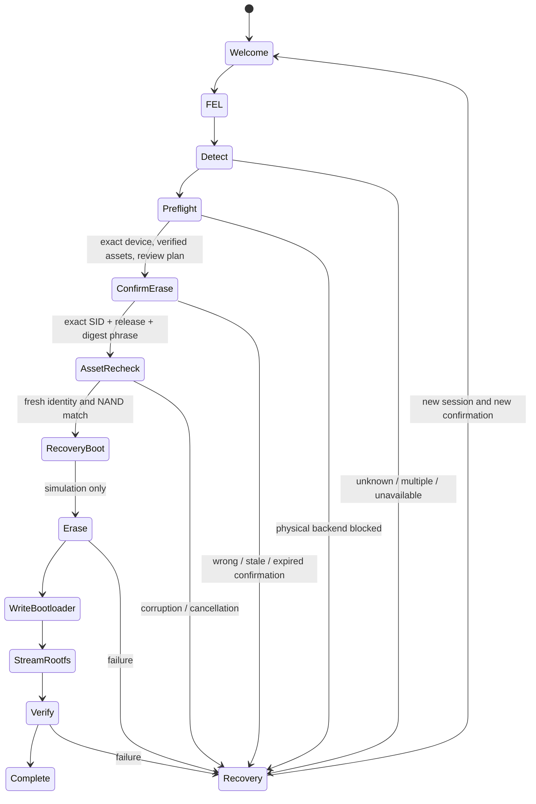

# Architecture

The workspace separates a synchronous reusable core from CLI/native egui frontends.
The GUI runs blocking operations on one cancellable worker; a bounded channel carries
typed stage/progress events and the prepared session. The CLI uses the same services.
No host Linux filesystem or administrative service is required by the core.

`Manifest::read` produces an immutable validated contract. `Cache` ingests bytes from
HTTPS or a regular offline file. `VerifiedAsset` retains a private verified file
snapshot, eliminating pathname replacement between cache checking and later use.

`Session<B>` owns the backend, `VerifiedAssets`, the review-only `NandPlan`, the
candidate identity, NAND choice, injected `Clock`, `SessionConfig` and terminal
`Outcome`. The sealed `Backend` trait has only two implementations: `MockFel` records
simulated operations and supports failure injection; `RealFel` can list FEL
candidates and refuses identity/boot/erase/write/verify/reboot operations. There is
no generic external-command transport accepting manifest arguments.



All assets are acquired and verified **before** confirmation is offered; the requested
Download stage after confirmation is a final snapshot recheck. A destructive operation
must never depend on a download that has not finished. User cancellation and all
backend failures invalidate prepared authorization. No automatic destructive retries
or reboot occur. Partial cached downloads cannot become usable artifacts.

## Batch 2 host seams

Batch 2 makes the host backend deterministic and testable before any hardware work.
It adds no physical implementation and no executor. The seams are:

| Seam | Purpose | Production | Scripted test double |
| --- | --- | --- | --- |
| `tool.rs` | External process execution | `SystemToolRunner` (the only `std::process::Command` user, bounded output/timeout/cancellation) | `ScriptedToolRunner` |
| `fel.rs` | Future FEL operations | `UnavailableFel` (every call returns `FelUnavailable`) | `ScriptedFel` |
| `nand.rs` | Reviewable install planning | none: `NandPlan::authorize_execution` always fails | plan fixtures from `VerifiedAssets` |
| `http.rs` | HTTPS asset retrieval | `UreqHttpClient` (pinned ureq, public hosts, bounded redirects) | `ScriptedHttpClient` + `ScriptedResponse` |
| `clock.rs` | Monotonic time for TTL logic | `SystemClock` | `TestClock` with explicit advancement |
| `script.rs` | Ordered expectation/failure injection | — | `Scripted<C, R>` shared by all doubles |

`ToolRequest`/`ToolOutput` cover executable+argv, environment, stdin, stdout,
stderr and exit status. `FelTransport` covers discovery, identification, device
information, RAM upload, execution and memory/status readback. Batch 2 uses these
types only through scripts and fixtures; no USB or FEL code exists.

### Trust flow

Only this ordering reaches destructive planning:

```text
input artifacts -> manifest validation -> cache/offline/HTTPS ingestion
                -> hash/size/snapshot verification -> VerifiedAssets
                -> + IdentifiedTarget -> NandPlan (review only)
```

`VerifiedAssets` has private fields and one constructor, `VerifiedAssets::verify`,
which requires a complete inventory matching the manifest role/size/hash for every
asset and rechecks each private snapshot. Planning accepts only `&VerifiedAssets`
plus a validated `IdentifiedTarget`; a filesystem path cannot reach planning.
Downloaded and offline bytes stay untrusted until the existing validation succeeds.

### NAND planning vs execution

`NandPlan` lists the exact ordered operations a future install would attempt:
operation kind, source artifact role, NAND offset or logical destination, byte
length and SHA-256 where known, prerequisites, readback verification identity and
the originating `Stage`. It also carries `PlanGate`s for every unresolved physical
question: unapproved manifest, missing authenticated recovery protocol, recovery
RAM address, real NAND/ECC/UBI geometry, bad blocks, the `0xC00000`
redundant-U-Boot/environment conflict, BROM/SPL acceptance and SPL fallback
behavior. `plan()` re-validates SPL-variant selection, exact lengths/digests,
stage order and NAND range non-overlap. There is no executor: `is_executable()`
is always false and `authorize_execution()` always returns `PhysicalBlocked`.

### Scripted transport testing and failure injection

`script.rs` provides an ordered call/result script. A call that does not match the
next expectation fails the script; an expected call that arrives after an injected
error, cancellation or exhaustion is refused instead of returning success. Tests can
therefore prove that later operations never ran. `ScriptedFel`,
`ScriptedToolRunner` and `ScriptedHttpClient` wrap this core with typed expectations
and record exact calls. Cancellation checks poison the script before any call.

### Session and clock behavior

`SessionConfig` exposes the confirmation TTL explicitly. Session code reads time only
through `Clock`; `TestClock::advance` lets tests cover not-yet-expired, exact-boundary
and expired confirmations without sleeping. Expiry is monotonic: if the clock ever
reports a time before `prepared_at`, the session fails closed as timed out.

### Progress model

`Stage::index` is strictly ordered, and `Session::report` emits stage milestones that
only ever move forward (a debug assertion guards regressions). Byte progress is
reported per logical item and never decreases inside one item. `Outcome` records one
terminal state — `Success`, `Failure` or `Cancelled` — and a failed or cancelled
session emits `Recovery` instead of any later success stage.

## Device decision logic (host-only fixtures)

`IdentifiedTarget::identify` accepts only an exact `PocketCHIP` board identifier with
the A13/R8 SoC family and a full known NAND part. Mismatched, ambiguous or unknown
fixtures are rejected; an unknown part never defaults to Hynix. The target exposes
exactly one SPL role, and the planner validates that every SPL write uses it. These
fixtures prove host decision logic only; they are not hardware behavior evidence.

Hardware NAND geometry (16 KiB pages, 4 MiB erase blocks; Hynix OOB 1664, Toshiba OOB
1280) is represented explicitly. Physical NAND identification cannot safely use
upstream's post-erase ID-register heuristic. A future reviewed recovery protocol must
report board/part/geometry before erase; the plan keeps that requirement as a gate.

The native UI uses egui/eframe with GL and embedded fonts; no browser, WebView or
network server is required. Clipboard/log access is explicit. Paths are entered as
text to keep dependencies and platform behavior simple. This is a functional
prototype with a polished workflow, not a signed production hardware flasher.

Installation profiles are a closed Rust enum, `Stock` (UI/CLI default) and
`VitrallisDefault` (explicit opt-in). The manifest requires a profile; the compiled
simulation catalog checks it against the selected release. Its bytes enter the
confirmation digest, so stock authorization cannot be reused for the Shell profile.
Both profiles use the same sealed backend and physical-write refusal. The host
`upgrade_debian13.py` script exposes build plans and delegates simulations using fixed
CLI arguments. It never runs the optional external Shell installer. Image plans keep
shared OS/PocketHome gates separate from Shell bundle and startup gates.

## Batch 3 native FEL diagnostics in progress

`fel_native.rs` implements explicit AWUC/AWUS/BROM framing through safe rusb
APIs. Individual USB calls time out within 500 ms; a handle has a 15-second
operation deadline. Cancellation is checked around transfers. Short inbound
transfers accumulate; zero/oversized inbound transfers and short outbound
transfers abort. Replies are bounded and signatures/status are checked. Each
operation opens the sole candidate and rereads SoC/protocol/SID on that same
handle before accessing SRAM. Reconnection may change bus/address, but cannot
change SID or introduce another candidate. No automatic retry resumes a write.

The current policy permits only 256 bytes at the source-documented A13 scratch
address 0x1000, with upload readback. Explicit execution requires the exact ARM `bx lr`
instruction at that address. SID identification uses a fixed aligned-word MMIO
reader in scratch SRAM, with readback and restoration, after SoC validation. `diagnostic_probe` restores the saved 256 bytes
after successful execution. Cancellation/failure may leave that harmless
scratch instruction. These bounds are provisional diagnostic policy, not a
validated recovery payload address. DRAM capacity, board and NAND cannot be
inferred from FEL: full `identify` remains blocked and unknown RAM is zero.

CLI `detect` and GUI detection with the optional tool field blank use native
USB. The explicitly selected external tool remains a diagnostic alternative.
CLI `fel-probe` exercises the bounded SRAM diagnostic without exposing editable
addresses. Recovery and destructive plan authorization remain blocked.


### Recovery development boundary

`flasher-recovery` is an ARMv7 daemon with authenticated Ping, Inventory,
BootReadback and RAM-only ReturnToFel operations. Protocol v3 includes native
BCH-64 SPL decoding alongside raw and kernel-corrected U-Boot interpretations.
Authentication, live SPL/U-Boot readback and return to FEL are measured on the
sacrificial Hynix device. The core `native-fel` feature separates desktop USB code from the
recovery build: CLI/GUI enable it, while the device daemon does not link libusb.
RAM bootstrap uses only fixed, hash-pinned inputs and constructed `ToolRequest`
arguments. Per-boot credentials live in a private directory and RAM initramfs.
This work has not changed NAND authorization or enabled a destructive executor.

Protocol v4 connects the restricted original-SPL trial guard and durable host
journal as developer diagnostics. Journal reads never authorize resumption,
and Verified cannot be recorded without the operation's checked readback.
Controlled physical testing remains required, as described below.

### Restricted Batch 3 original-SPL diagnostic

Protocol v4 exposes a two-phase original-SPL primary trial for the measured
sacrificial SID only. Device-local preflight, an exact clean restoration snapshot,
a single-use connection ticket and durable host intent gate the fixed mtd0
mutation. Cancellation before dispatch sends no execute request; cancellation or
response loss after dispatch is indeterminate. Device RAM journals survive socket
loss, and verified replies require primary readback plus the unchanged backup boot
chain. This diagnostic does not enable the production `NandPlan`, release catalog
or GUI flash path. Primary erasure, normal backup boot and clean original-program restoration are
physically verified. Protocol v5 adds closed backup isolation/restoration while
protecting the primary. Physical host interruption after backup-erase dispatch
preserves an Indeterminate host journal while the device finishes its committed
operation; a separate read-only session verifies erasure and the protected chain.
Isolated restored-primary boot and release installation
remain pending.

### Authenticated rootfs eraseblock map

Protocol v6 adds a closed read-only RootfsMap request backed by the existing
mtdinfo utility through ToolRunner. Recovery supplies its local rootfs geometry,
checks it before and after enumeration, and returns bounded utility output.
The host independently validates every logical eraseblock entry, count and final
BBT sentinel before accepting the response. This snapshot grants no NAND write
capability; execution still requires the unresolved physical gates. No path,
address or utility argument is supplied by the GUI or manifest. The eleventh RAM session physically executes v6 enumeration with all 2,044 entries
and the original 65 unavailable indices. Independent boot-chain readbacks remain
healthy; write skipping and production installation still require validation.
