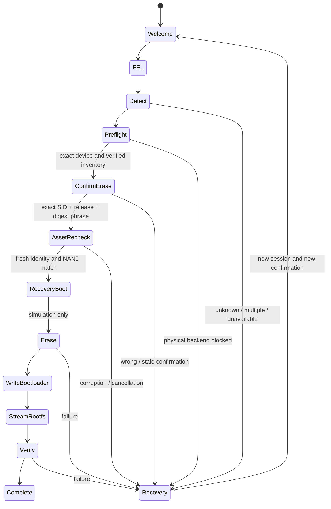

# Architecture

The workspace separates a synchronous reusable core from CLI/native egui frontends.
The GUI runs blocking operations on one cancellable worker; a bounded channel carries
typed stage/progress events and the prepared session. The CLI uses the same services.
No host Linux filesystem or administrative service is required by the core.

`Manifest::read` produces an immutable validated contract. `Cache` ingests bytes from
HTTPS or a regular offline file. `VerifiedAsset` retains a private verified file
snapshot, eliminating pathname replacement between cache checking and later use.

`Session<B>` owns the backend, manifest, payloads, candidate identity, NAND and
five-minute preflight lifetime. The sealed `Backend` trait has only two implementations:
`MockFel` records simulated operations and supports failure injection; `RealFel` can
list FEL candidates and refuses identity/boot/erase/write/verify/reboot operations.
There is no generic external-command transport accepting manifest arguments.

All assets are acquired and verified **before** confirmation is offered; the requested
Download stage after confirmation is a final snapshot recheck. A destructive operation
must never depend on a download that has not finished. User cancellation and all
backend failures invalidate prepared authorization. No automatic destructive retries
or reboot occur. Partial cached downloads cannot become usable artifacts.

Hardware NAND geometry (16 KiB pages, 4 MiB erase blocks; Hynix OOB 1664, Toshiba OOB
1280) is represented explicitly. Unknown part names are rejected. Physical NAND
identification cannot safely use upstream's post-erase ID-register heuristic. A
future reviewed recovery protocol must report board/part/geometry before erase.

The native UI uses egui/eframe with GL and embedded fonts; no browser, WebView or
network server is required. Clipboard/log access is explicit. Paths are entered as
text to keep dependencies and platform behavior simple. This is a functional
prototype with a polished workflow, not a signed production hardware flasher.

Installation profiles are a closed Rust enum, `Stock` (UI/CLI default) and
`VitrallisDefault` (explicit opt-in). The manifest requires a profile; the compiled
simulation catalog checks it against the selected release. Its bytes enter the
confirmation digest, so stock authorization cannot be reused for the Shell profile.
Both profiles use the same sealed backend and physical-write refusal. The host
`upgrade_debian13.py` script exposes build plans and delegates simulations using fixed
CLI arguments. It never runs the optional external Shell installer. Image plans keep
shared OS/PocketHome gates separate from Shell bundle and startup gates.
