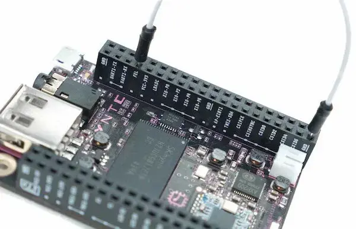

# FEL connection and driver guidance

Disconnect power and USB before placing a jumper between the board's **FEL** pin and
**GND**, using the PocketCHIP/CHIP board pinout for the exact revision. Do not guess
nearby pin positions. Then connect a USB **data** cable. Disconnect other Allwinner
FEL devices so selection is unambiguous. A charging-only cable cannot enumerate FEL.

## Two different physical layouts

### Bare CHIP: jumper on the board headers

User-supplied reference photograph. This shows the bare CHIP board, not the exposed
PocketCHIP top pads. The [manufacturer's CHIP instructions](https://docs.getchip.cc/chip#fel-mode)
identify the FEL-to-GND jumper; its SDK instructions identify U14 pins 7 and 39.
Check the board revision and printed labels before placing a wire.

### PocketCHIP: exposed pads along the top edge

This original schematic shows the **front view** with the screen facing you. At the
right end of the exposed top pad row, **FEL** sits immediately to the right of
**GROUND**. Match those labels on the actual device; other pads are omitted from the
diagram. Shut down and unplug USB before positioning the jumper, keep the conductor
clear of neighboring pads, then connect the micro-USB data cable to the host.

The pad labels were checked against the [PocketCHIP top-edge reference photo](https://guide-images.cdn.ifixit.com/igi/SchYaRQPxFFcdYBS.huge)
and the [manufacturer's GPIO-access documentation](https://docs.getchip.cc/pocketchip#gpio-access).
The diagram is not a photograph of a tested setup. The original manufacturer
[flashing instructions](https://docs.getchip.cc/pocketchip#flashing) describe removing
CHIP and flashing it separately. This project's top-pad illustration documents the
connection; it does **not** establish a validated in-case recovery procedure or enable
physical flashing. Device detection must confirm FEL; a jumper alone is not proof.

Image provenance is recorded in [images/README.md](images/README.md).

The usual Allwinner FEL USB identity is VID `1f3a`, PID `efe8`. It is a USB interface
identity, not proof of PocketCHIP board type. This application's real diagnostic path
calls a user-selected `sunxi-fel --list` and does not boot or flash it. That command
can access USB to read SoC/SID; no actual device discovery was run in this work.

## Windows x86-64

Provide a reviewed sunxi-fel `.exe` and matching libusb runtime. Check Device Manager
for the exact FEL interface and its current driver. If USB access is missing, an
administrator must deliberately select a suitable WinUSB-compatible driver for that
specific interface. Never replace a keyboard, storage, hub or unrelated USB driver.
The application does not download, install or silently replace drivers, and a missing
runtime/tool failure includes this guidance rather than escalating privileges.

FEL access and the subsequent recovery network gadget are separate driver problems.
A working WinUSB FEL connection does not prove that a recovery gadget is reachable.
The upstream RNDIS-only mode and any replacement ECM/NCM configuration require their
own Windows compatibility tests. Do not change the host's default route or DNS for
recovery. The app currently blocks physical recovery before this transition.

CI artifacts are unsigned ZIPs, not installers. No Authenticode certificate, signed
INF/CAT, driver redistribution, trusted publisher reputation or SmartScreen bypass
is supplied. Those remain distribution tasks. This app does not instruct users to
disable system security or install unsigned drivers.

## macOS arm64 / x86-64

Install a reviewed sunxi-fel/libusb build separately. Use its canonical absolute
executable path; resolve a package-manager symlink to the versioned binary first.
Check cable/jumper and close competing USB tools. The app never uses sudo.
The current upstream RNDIS-only recovery image is not a validated macOS networking
solution; a tested ECM/NCM recovery gadget is a physical-release gate.

Local packages contain an app bundle but no Developer ID signature, notarization or
stapling. Gatekeeper behavior must be tested before distribution. Do not claim that
an unsigned local package is equivalent to a notarized release.

## Linux x86-64 / arm64

Provide sunxi-fel/libusb and narrowly scoped USB access. If access is denied, ask an
administrator to review the VID/PID and the relevant device permissions or udev rule.
Reconnect after a permission change. The core does not read `/sys`, install rules,
invoke sudo, or depend on a Linux network interface name. Dynamic GL/X11/Wayland
libraries are required by the desktop GUI; the CLI does not require a display.
